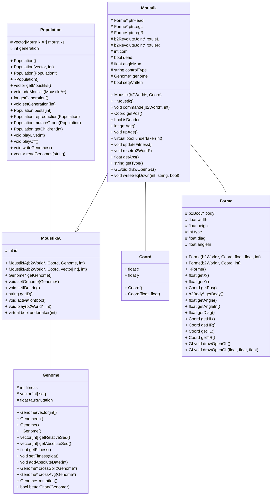

# Compte Rendu
_Chloé Leric_ et _Victor Duvivier_.

Notre projet consiste en l'application d'un ou de plusieurs algorithmes génétiques sur un mini-jeu. Nous nous sommes inspirés du mini-jeu [Daddy Long Legs](https://play.google.com/store/apps/details?id=com.setsnail.daddylonglegs&hl=fr)

## Sujet

Le but de notre algorithme est de générer un ensemble de `moustiks` et de les faire jouer dans un environnement physique 2D. Un algorithme génétique est ensuite appliqué pour améliorer les performances de déplacement des `moustik`. Le critère utilisé pour départager les individus est la distance (positive) maximale parcourue par le `moustik`.

## Décision du sujet

## Description du code

Les différentes classes existant dans notre code sont:
+ `Forme` cette classe correspond à un rectangle physique. Elle permet d'automatiser la création de boîtes physiques et facilite l'écriture des fonctions d'affichage de ces formes sous `OpenGL`.

  + Cette classe contient un attribut `b2Body* body` issu de la librairie moteur physique `Box2D` qui correspond à un point 2D de l'espace.
  + Le constructeur rattache à ce corps une `Box` qui vas permettre de gérer les collisions et de donner un _"volume"_ à la boîte. Cette boîte est de demie-largeur `width` et de demie-hauteur `height`.
  + L'attribut `type` définit si l'objet créé est fixe ou si il est dynamique (le sol est fixe, le `moustik` est dynamique).
  + `diag` et `angleIn` correspondent à des données géométriques invariantes, mais utilisées lors du processus d'affichage. Pour éviter de faire des calculs trigonométriques couteux en processus inutilement, on préfère stocker ces valeurs directement en attribut.

+ `Genome` cette classe contient l'information de notre moustique

  + Une séquence d'entiers `vector<int>`correspondant aux frames où le `moustik` change d'appui.
  + Ainsi qu'un réel `fitness` qui correspond à la distance maximale atteinte par le moustik avec cette séquence _(le constructeur fixe sa valeur à -1)_.
  + `tauxMutation` correspond à la probabilité qu'a un moustik de muter lorsqu'il rentre dans la phase de mutation.

+ `Moustik` cette classe correspond au concept de notre animal bipède.

  + Il possède trois attributs `Forme`, correspondant à sa tête et à ses deux jambes.

  + Il possède deux attributs de type `b2RevoluteJoint` permettant de définir les points de liaison entre la tête et chacune des jambes, les rotules peuvent aussi être activées en tant que moteur en définissant une vitesse de rotation désirée ainsi qu'un couple maximal.

  + L'attribut `com` correspond à la commande utilisateur. Il vaut 0 initialement _(aucune jambe commandée)_ puis il oscille entre 1 et 2 pendant le jeu _(jambe gauche et jambe droite activée respectivement)_ . Un appui sur  s applique la transformation suivante :
    $$
    com = 1+com\%2
    $$

  + Le booléen `dead` correspond à si le `moustik` est tombé ou non.

  + Le réel `angleMax` correspond à l'angle maximal toléré pour les rotules.

  + L'attribut `controlType` vaut "human" ou "IA" et est utilisé pour l'écriture dans des fichiers texte des génomes respectifs.

  + Un attribut `génome` toutes les données génétiques nécessaires.

  + Le booléen `seqWritten` permet de n'écrire qu'une fois la séquence de jeu du moustique.

+ `MoustikIA` correspond à un `moustik` géré par l'ordinateur.

  + un entier `int` "ID" permet de le différencier de ses camarades générés par dizaines.

+ `Population` correspond à une génération de moustiks.

  + Cette classe contient donc une liste `vector<MoustikIA*>` .
  + Ainsi que l'entier `generation` correspondant à la génération de cette population.

### Diagramme de classe

`+` public
`#` protected

## Bibliographie

pdf
: [NatureOfCode](https://natureofcode.com/book/chapter-5-physics-libraries/)

youtube
: [DaddyLongLeg game](https://www.youtube.com/embed/noNl_cvYLu8)
