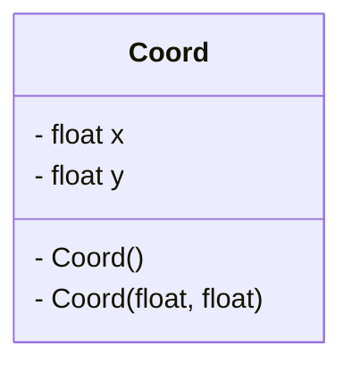
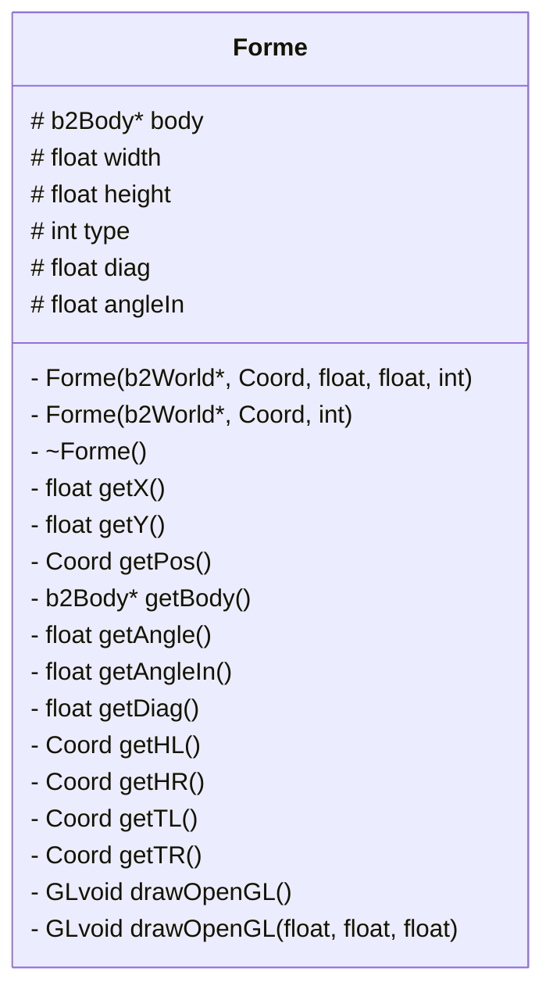
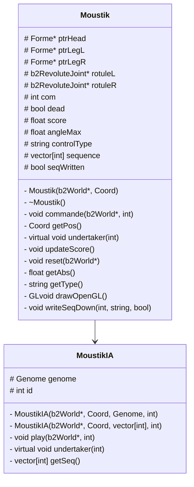
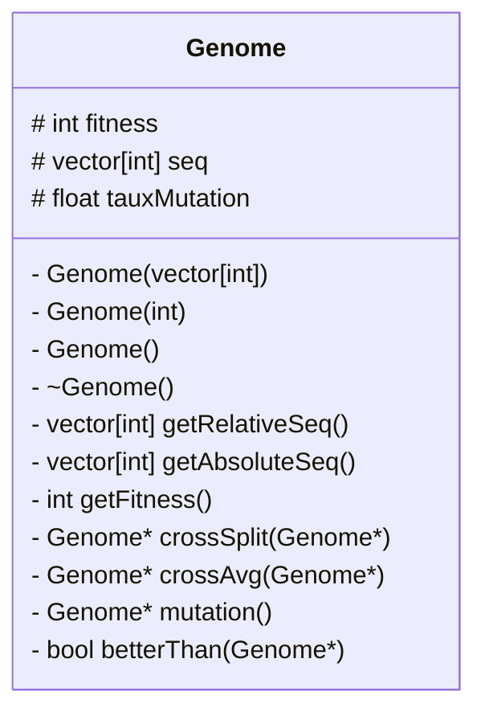
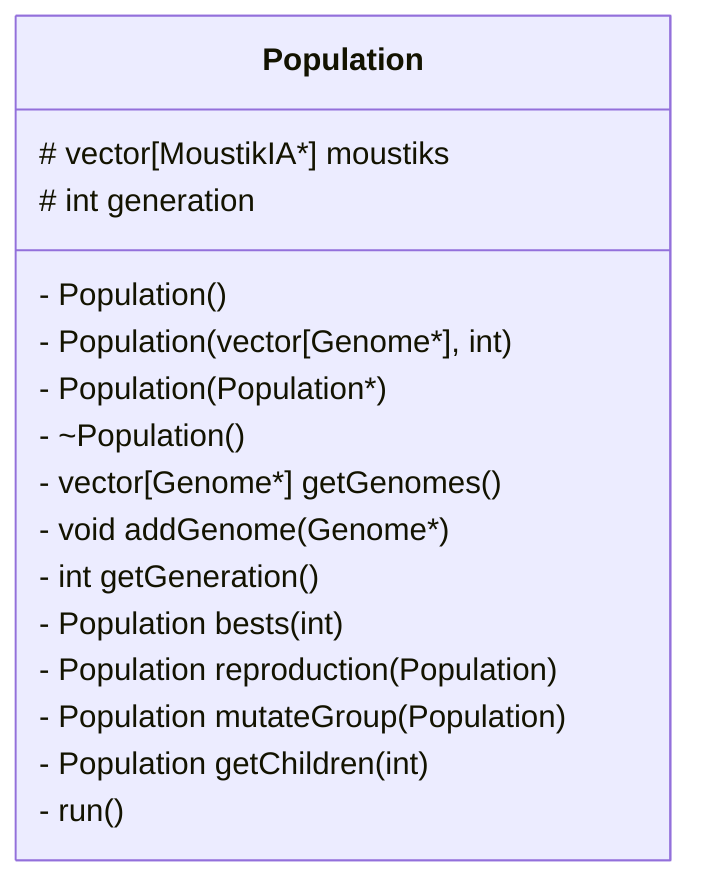

# Compte Rendu
_Chloé Leric_ et _Victor Duvivier_.

## Introduction
Notre projet consiste en l'application d'un ou de plusieurs algorithmes génétiques sur un mini-jeu.

[//]: # (<iframe width="560" height="315" src="https://www.youtube.com/embed/noNl_cvYLu8" frameborder="0" allow="accelerometer autoplay encrypted-media gyroscope picture-in-picture" allowfullscreen></iframe>)

## Explication générale du code
Le but de notre algorithme est de générer
### Diagramme de classe
Les différentes classes existant dans notre code sont:
+ `Forme` cette classe correspond à un rectangle physique. Cette classe contient un attribut `b2Body* body` issu de la librairie moteur physique `Box2D`. La classe forme permet d'automatiser la création de boîtes physiques et facilite l'écriture des fonctions d'affichage de ces formes sous `OpenGL`.
+ `Genome`
+ `Moustik` cette classe correspond au concept de notre animal bipède. Il possède trois attributs `Forme`, correspondant à sa tête et à ses deux jambes.

`-` public
`+` private
`#` protected

faire une méthode pour population qui lance la simulation des moustiks un par un, qui détermine leur fitnesse à chacun et qui ensuite écrive dans des dossiers (génération/id xxx/yyy).

writeGenomes() de Population écrit un fichier "generationXXX.txt" contenant des séquences avec des retours à la ligne.

## Bibliographie
pdf
: [NatureOfCode](https://natureofcode.com/book/chapter-5-physics-libraries/)

youtube
: [DaddyLongLeg game](https://www.youtube.com/embed/noNl_cvYLu8)
