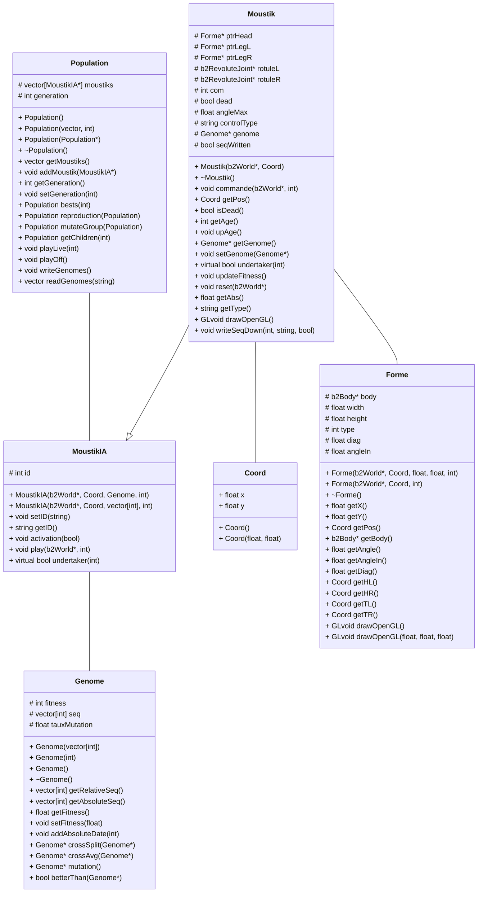

# COMPTE-RENDU : P1 RV

**_Chloé Leric_ - _Victor Duvivier_.**

dépot GitHub : `https://github.com/vicco-rgb/MoustikGenetik.git`

Notre projet consiste en l'application d'un ou de plusieurs algorithmes génétiques sur un mini-jeu. Nous nous sommes inspirés du mini-jeu __DaddyLongLeg__


## Sujet

Le but de notre algorithme est de générer un ensemble de `moustiks` et de les faire jouer dans un environnement physique 2D. Un algorithme génétique est ensuite appliqué pour améliorer les performances de déplacement des `moustik`. Le critère utilisé pour départager les individus est la distance (positive) maximale parcourue par le `moustik`.

## Déroulement du projet

Nous avons travaillé sur ce projet en deux grandes étapes qui se sont superposées au milieu du projet. La première partie du projet a été de modéliser l'environnement physique et les déplacements du personnage, et la seconde d'implémenter un algorithme génétique qui permettrait de faire avancer le plus loin possible notre personnage.
### Première partie : la marche

Durant environ le premier mois, nous nous sommes concentrés uniquement sur le fait d'implémenter les mouvements du moustik, contrôlés par l'utilisateur. Notre approche a été tout d'abord d'imiter un environnement physique, sans pour autant faire entrer en jeu des concepts d'accélération ou d'inertie, mais au contraire en la simplifiant au maximum. La méthode consistait simplement à faire "tomber" le moustik à chaque fois que sa jambe effectuait une rotation par l'utilisateur. Mais rapidement, nous nous sommes rendu compte que cette méthode laissait place à trop d'incertitude et de subjectivité quant au déplacement du moustik : le moindre changement dans une modalité de contrôle du mouvement provoquait un impact non maîtrisable sur la marche du moustik. Ainsi, dans les premières semaines de programmation, le moustik était incapable de faire plus de 2 ou 3 pas sans mourir ; puis des changements dans la logique de marche firent qu'il pouvait marcher presque à l'infini sans jamais tomber. Nous avons alors eu l'idée d'augmenter la difficulté en conservant cette dernière version du moustik, mais en ayant un sol pouvant monter et descendre. Malheureusement, ceci n'a pas résolu le problème :

1. Le `moustik` marchait toujours assez facilement.
2. Des problèmes de pieds traversant le sol se re-posaient et devinrent plus compliqué à résoudre.

Nous avons alors décidé de changer radicalement d'approche et de nous tourner vers un _physics engine_ :  **Box2D**. Cette approche présentait l'avantage majeur de nous débarasser de toute la partie implémentation d'un environnement physique (et donc calculs en découlant), et d'automatiser les mouvements du moustik. L'inconvénient était cependant le temps d'appropriation et d'apprentissage du moteur physique, mais surtout le temps d'apprentissage d'ajout de nouvelles librairies à un projet. Après quelques tâtonnements pendant deux semaines, une fois que nous avons commencé à comprendre la logique du moteur physique, l'implémentation a été très rapide et nous avons enfin put avoir une logique de déplacement du moustik qui nous convenait.

### Deuxième partie : l'algorithme génétique

Quelques semaines après le lancement du projet, nous avons débuté en parallèle de la première partie, une réflexion sur la partie à proprement parler _d'algorithme génétique_. Étant donné que la première partie n'était pas finie, la partie algorithme génétique a tout d'abord été appliquée à des suites d'entiers générés aléatoirement dont le "score" ( _fitness_) était leur somme. Nous avons tout d'abord réfléchi à une logique de reproduction de la population de solutions avant de commencer à programmer. En effet, entre chaque génération, 

1. On sélectionne les `n` meilleures solutions
2. Ensuite, on sélectionne aléatoirement `n` paires de solutions dans ces meilleures solutions. 
3. Ces paires produisent à leur tour `n` solutions filles.
4. On viens ensuite compléter la population fille obtenue avec des `moustik` pris aléatoirement parmis les meilleurs pour obtenir une population contenant le même nombre d'individus que initialement.
5. On effectue ensuite une mutation sur une petite partie des "gènes" des solutions (qu'on appellera _génomes_). La mutation aléatoire est nécessaire de manière à ramener un peu d'aléatoire dans l'évolution des générations (tout comme en génétique réelle), de manière à ne pas converger trop rapidement vers un extremum local. 

L'implantation d'un algorithme génétique relativement simple et s'appliquant aux cas abstraits des suites d'entiers nous a pris quelques semaines. Par la suite, il a fallut réfléchir à la logique d'application de l'algorithme génétique à la marche du moustik. En effet, le choix d'encodage des génomes solutions est primordial, car il pré-détermine la programmation du reste de l'algorithme, et la convergence ou non des résultats. Plusieurs possibilités s'offraient à nous : 

- coder les solutions sur des suites de bits correspondant à chaque frame où une jambe était levée (1 = jambe gauche, 0 = jambe droite par exemple). 
- Il était également possible de d'utiliser des suites d'entiers qui correspondraient aux temps en millisecondes durant lequel l'une des deux jambes et levé. 

Les deux approches étaient relativement comparables, avec une différence dans les possibilités de croisement par exemple. Nous avons opté pour la deuxième solution. 

### Troisième partie : le moustik génétique

Les dernières semaines du projet ont consisté à relier entre elles les deux parties présentées précedemment. Ainsi, il a fallut programmer plusieurs méthodes pour tout d'abord commander le moustik non plus grâce aux touches du clavier mais par des suites d'entiers envoyées par l'algorithme génétique. Par ailleurs, ils fallait également pouvoir avoir un retour des performances des moustiks à renvoyer aux classes `population` et `génome` afin de pouvoir effectuer les modifications sur la génération suivante. Nous nous sommes également rendu compte que les méthodes de  croisement utilisée dans le cas abstrait ne présentaient pas des résultats très concluants et n'avait pas énormément de sens dans notre cas. Il a donc fallu trouver une autre méthode de croisement de génomes parents qui ne se basait plus sur un **croisement** à proprement parler (on prend la première partie du premier parent et la deuxième partie du deuxième parent), mais plutôt sur l'idée d'une moyenne des deux génomes pondérée par la performance respective de chaque parent.  

## Description du code

### Description classes

Les différentes classes existant dans notre code sont:

+ ##### **`Forme`** cette classe correspond à un rectangle physique. Elle permet d'automatiser la création de boîtes physiques et facilite l'écriture des fonctions d'affichage de ces formes sous `OpenGL`.

  + Cette classe contient un attribut `b2Body* body` issu de la librairie moteur physique `Box2D` qui correspond à un point 2D de l'espace.
  + Le constructeur rattache à ce corps une `Box` qui vas permettre de gérer les collisions et de donner un _"volume"_ à la boîte. Cette boîte est de demie-largeur `width` et de demie-hauteur `height`.
  + L'attribut `type` définit si l'objet créé est fixe ou si il est dynamique (le sol est fixe, le `moustik` est dynamique).
  + `diag` et `angleIn` correspondent à des données géométriques invariantes, mais utilisées lors du processus d'affichage. Pour éviter de faire des calculs trigonométriques coûteux en processus inutilement, on préfère stocker ces valeurs directement en attribut.

+ ##### **`Genome`** cette classe contient la performance de notre moustique et les méthodes de reproduction des solutions appliquées à un génome.

  + Une séquence d'entiers `vector<int>`correspondant aux frames où le `moustik` change d'appui.
  + Ainsi qu'un réel `fitness` qui correspond à la distance maximale atteinte par le `moustik` avec cette séquence _(le constructeur fixe sa valeur à -1)_.
  + `tauxMutation` correspond à la probabilité qu'a un `moustik` de muter lorsqu'il rentre dans la phase de mutation.

+ ##### **`Moustik`** cette classe correspond au concept de notre animal bipède.

  + Il possède trois attributs `Forme`, correspondant à sa tête et à ses deux jambes.
  + Il possède deux attributs de type `b2RevoluteJoint` permettant de définir les points de liaison entre la tête et chacune des jambes, les rotules peuvent aussi être activées en tant que moteur en définissant une vitesse de rotation désirée ainsi qu'un couple maximal.
  + L'attribut `com` correspond à la commande utilisateur. Il vaut 0 initialement _(aucune jambe commandée)_ puis il oscille entre 1 et 2 pendant le jeu _(jambe gauche et jambe droite activée respectivement)_ . Un appui sur  s applique la transformation suivante : $com=1+com\% 2$
  
  + Le booléen `dead` correspond à si le `moustik` est tombé ou non.
  + Le réel `angleMax` correspond à l'angle maximal toléré pour les rotules.
  + L'attribut `controlType` vaut "human" ou "IA" et est utilisé pour l'écriture dans des fichiers texte des génomes respectifs.
  + Un attribut `génome` toutes les données génétiques nécessaires.
  + Le booléen `seqWritten` permet de n'écrire qu'une fois la séquence de jeu du moustique.
  
+ ##### **`MoustikIA`** correspond à un `moustik` géré par l'ordinateur.

  + un entier `ID` permet de le différencier de ses camarades générés par dizaines.

+ ##### **`Population`** correspond à une génération de moustiks. Elle permet de gérer toutes les opérations sur une population de solutions.

  + Cette classe contient donc une liste `vector<MoustikIA*>` .
  + Ainsi que l'entier `generation` correspondant au numéro de génération de cette population.

### Diagramme de classe

`+` public
`#` protected



### Description méthode algorithme génétique

Voici quelques explications sur certaines méthodes des classes de l'algorithme génétique pour celles qui pourraient en avoir besoin.

#### `getChildren`

La classe `Population` possède une méthode `getChildren` qui permet d'obtenir la génération suivante en renvoyant une nouvelle population.

```cpp
Population* Population::getChildren(int n){
  //renvoie la population fille contenant le même nombre d'individus. Elle a été formée à partir des n meilleurs parents.
  if (n>moustiks.size()){
    //pour ne pas faire planter l'algorithme
    n=moustiks.size();
  }
  //on trie la population active selon leur fitness et on récupère les n meilleurs individus
  Population* bestPop = bests(n);
  //on produit n enfants à partir des n meilleurs parents
  Population* newGeneration = reproduction(bestPop);
  while (newGeneration->getMoustiks().size()<moustiks.size()){
    //on complète la population fille avec les meilleurs parents pris aléatoirement.
    newGeneration->addMoustik(bestPop->getMoustiks()[rand()%n]);
  }
  //chaque date de chaque génome a une probabilité d'évolution.
  newGeneration = mutateGroup(newGeneration);
  return newGeneration;
}
```

#### `bestPop`

La méthode `bestPop` issue de la classe `Population` est simplement un algorithme de tri suivi d'un remplissage d'un vecteur. Peu spécifique, nous ne détaillerons pas son fonctionnement ici.

#### `reproduction`

On fait ensuite appel à la méthode`reproduction`. Celle-ci produit une population aussi nombreuse que le nombre de parents qu'on lui fait entrer. On détermine aléatoirement 2 parents que l'on fait se reproduire selon la méthode `crossAvg` et l'on répète cette opération jusqu'à avoir créé suffisamment d'enfants.

```cpp
Population* Population::reproduction(Population pop){
  //size = nombre de parents
  int size=pop.getMoustiks().size();
  //on vas générer autant d'enfants que de parents
  vector<MoustikIA*> children = pop.getMoustiks();
  //pour initialisation des nouveaux moustiks, on a besoin d'un pointeur vers une classe issue de la librairie Box2D.
  b2World* ptrWorldIAs = moustiks[0]->getWorld();
  for (int i=0;i<size;i++){
    //on cherche un papa et une maman pour l'enfant au hasard.
    int dad=rand()%size;
    int mom=rand()%size;
    while (dad==mom){
      //papa et maman doivent être différents.
      mom=rand()%size;
    }
    //on croise papa et maman pour donner un enfant
    Genome* genomei = pop.getMoustiks()[dad]->getGenome()->crossAvg(pop.getMoustiks()[mom]->getGenome());
    //on instancie le fils dans l'environnement
    children[i] = new MoustikIA(ptrWorldIAs, Coord(0.0,3.0), genomei, to_string(i));
    //on le désactive pour ne pas que les collisions ne soient pas calculées
    children[i]->activation(false);
  }
  return new Population(children, pop.getGeneration()+1);
}
```

##### `crossAvg`

La méthode appelée à la ligne 17 issue de la classe `Génome` permet de croiser deux parents. Cette méthode produit un enfant génome à partir de deux parents en faisant la moyenne de chaque paire de dates. On a nommé les séquences `litSeq` et `bigSeq` dans l'éventualité où une séquence serait plus grande que l'autre.

Si la séquence du père est plus grande que la séquence de la mère par exemple, alors on moyenne les (nombres-de-dates-dans-la-séquence-de-la-mère) premières dates du père et de la mère et on ajoute ensuite  à la séquence fille les dernières dates du père.

```cpp
Genome* Genome::crossAvg(Genome* genome){
  vector<int> seqout;
  vector<int> bigSeq;
  vector<int> litSeq;
  if (seq.size()>=genome->getRelativeSeq().size()){
    bigSeq = seq;
    litSeq = genome->getRelativeSeq();
  } else {
    bigSeq = genome->getRelativeSeq();
    litSeq = seq;
  }
  for (int i=0; i<litSeq.size(); i++){
    //moyenne pondérée des dates par le ratio des fitness
    seqout.push_back((bigSeq[i]+litSeq[i])/2);
  }
  for (int j=litSeq.size(); j<bigSeq.size();j++){
    //on complète sans moyenner avec la séquence qui est plus grande
    seqout.push_back(seq[j]);
  }
  return new Genome(seqout, 0);
}
```

#### `mutateGroup`

Cette méthode permet de modifier les `Genome` de tous les individus aléatoirement. Elle appelle la méthode `mutation` de la classe `Genome` pour tous les `moustik`. La séquence de jeu d'un individu ne doit être constitué que de dates strictement positives car elles correspondent à des intervalles de temps entre lesquels le `moustik` n'a pas changé de jambe. Il ne peut pas non plus changer deux fois de jambe à la même frame.

```cpp
Genome* Genome::mutation(){
  vector<int> mutseq=seq;
  //on parcourt toutes les dates de la séquence.
  for (int i=0; i<seq.size(); i++){
    int prob = rand()%100/100;
    if (prob<tauxMutation){
      //alors mute et se modifie aléatoirement de +/- 5 frames
      int mudate=abs(seq[i]+rand()%11-5); //on veut une valeur positive...
      if (mudate==0){
          mudate=1; //... positive stricte!
      }
      mutseq[i]=mudate;
    }
  }
  return new Genome(mutseq, -1);
}
```

## Résultats

Notre programme est opérationnel. Nous avons plusieurs choix de lancements qui sont tous trois fonctionnels.

1. Jeu par l'utilisateur en appuyant sur `s` pour changer la jambe portante
2. Vidéo de visualisation des performances de tous les moustiks.
3. Génération de populations successives sans affichage OpenGL _(plus rapide)_

Pour ce qui est de l'algorithme génétique, nos premiers moustiks débutent à la première génération _(avec des séquences aléatoires)_ avec un avancement de l'ordre d'une dizaine de cm pour le meilleur moustik. Après 100 générations, on obtient des moustiks pouvant se déplacer jusqu'à 3 mètres! (exemple ici avec une population de 20 individus).

```bash
genomes written to ../sequences/generation0.txt
	 meilleur score : 0.148396
genomes written to ../sequences/generation1.txt
	 meilleur score : 1.7607
genomes written to ../sequences/generation2.txt
	 meilleur score : 0.651068
[...]
genomes written to ../sequences/generation76.txt
	 meilleur score : 0.000689425
genomes written to ../sequences/generation77.txt
	 meilleur score : 0.0225119
[...]
genomes written to ../sequences/generation99.txt
	 meilleur score : 3.10842
```

Cependant, il semblerait que notre algorithme tel qu'il est concu n'est pas très efficace pour permettre d'aller beaucoup plus loin. Plus de temps serait nécessaire pour améliorer des problèmes persistants. Comme on peut en effet le remarquer au-dessus, l'algorithme fait parfois régresser ses populations jusqu'à parfois retourner au point de départ. 

On remarque aussi des problèmes dans les séquences des moustiks puisque celles-ci comprennent des séquences s'agrandissant au fur et à mesure des générations _(40 dates à la génération 0 jusqu'à une page de dates à la génération 100)_, ainsi que le fait que des dates négatives apparaissent.

### Avec plus de temps...

Si nous avions eu plus de temps, nous aurions aimé pouvoir expérimenter des méthodes de génétique faisant intervenir des capteurs du moustique. Le moustique aurait donc pu s'adapter beaucoup plus facilement à un changement d'environnement.

Nous aurions aussi pu jouer sur d'autres variables que uniquement les dates des séquences. Nous aurions par exemple pu jouer d'une génération à l'autre sur le poids du moustik, l'adhérence de chacun des pieds, la taille de ses membres, la force des ses cuisses ainsi que leurs vitesses de rotations...


## Conclusion

### Difficultés rencontrées

Les principales difficultés que nous avons rencontrées sont venues de deux problèmes principaux. 

1. Tout d'abord, des problèmes techniques liés à la compréhension et à l'apprentissage de librairies ou de principes de programmation (Box2D, Cmake, importation librairies...) qui nous était inconnus jusqu'à maintenant. En effet, nous avons passé une grande quantité de temps à simplement apprendre à manipuler les outils qui nous étaient nécessaires à la réalisation du projet, et à résoudre des erreurs de compilation, d'installation, de visualisation, qui n'étaient pas en soi liés au problème de l'algorithme génétique à proprement parler. Nous avons également eu jusqu'à la fin du projet des problèmes liés aux changements de plateforme (Linux/Mac), avec le code qui se compilait sur une et pas sur l'autre etc. Cependant, une fois les problèmes techniques dépassé, nous avons constaté une progression assez rapide. Ceci a donc crée un rythme d'avancement assez inconstant, avec des pics de progressions rapides et des moments de stagnation. 

2. Cela nous amène à une deuxième difficulté que nous avons put avoir : la gestion du temps et l'organisation. Nous nous sommes rendu compte qu'il était assez compliqué d'estimer le temps de travail de chaque étape du projet dut aux nombreux imprévus auxquels nous avons fait face. Par exemple, nous avons mis plus de temps que prévu à programmer la marche du moustik, ce qui nous a amené à devoir mettre les bouchées doubles pendant la fin du projet pour pouvoir le finir. Il était aussi facile de s'éterniser sur certaines étapes qui n'en avait peut-être pas tant besoin (perfectionnement de la marche ou de l'affichage), au détriment d'étapes ultérieures plus importantes. Par ailleurs, il était parfois difficile de se répartir le travail et de savoir quelle tâche pouvait être effectuée tout seul et quelle tâche devait être faite à deux. 
   Avant d'avoir des cours sur Git, il était également compliqué de partager notre code et notre avancement entre nous. 

### Apprentissage

Les difficultés rencontrées durant ce projet nous ont cependant permis de nous améliorer dans de nombreux domaines. Ce projet nous a fait collaborer en groupe sur un projet long et qui demandait beaucoup d'heures d'investissement, nous obligeant à trouver des manière efficace de s'organiser et de communiquer (Git, Facebook, Dropbox...). Cela nous a montré en quelque sorte les difficultés de travailler à plusieurs sur le même code (même si nous n'étions que deux, les enjeux étaient présents), à structurer son code de manière optimale pour débogger, mais également pour que le binôme puisse comprendre rapidement les modifications et avancés faites par l'un d'entre nous. 

Ce projet nous a également évidemment permis de nous améliorer en programmation C++ et OpenGL, tout en nous ouvrant à de nouveaux outils qui pourront nous être utiles plus tard (manipulation de CMake, _physics engines_...). Il a été très intéressant de découvrir le principe de l'algorithme génétique et de s'y confronter avec un exemple comme celui que nous avions choisi, et de voir de nos propres yeux la progression des moustiks en live. Il était enrichissant de se confronter à un problème qui s'éloignait un peu de la thématique de l'option Réalité Virtuelle et par conséquent d'ouvrir notre curiosité et nos connaissances à de nouveaux champs pas abordés en cours. Si nous avions eut plus de temps à la fin, il aurait été intéressant de jouer plus sur les différents paramètres de l'algorithme génétique, comme tester d'autres méthodes de sélection (probabilité de sélection proportionnelle à l'adaptation plutot que tri simple), de croisement (plusieurs points de croisement, plusieurs enfants pour des paires de parents...), variations du taux de mutation etc. 

## Bibliographie

pdf
: [NatureOfCode](https://natureofcode.com/book/chapter-5-physics-libraries/)

youtube
: [DaddyLongLeg game](https://www.youtube.com/embed/noNl_cvYLu8)
